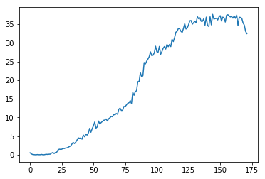

# Project II: Continuous Control

## Introduction

The project uses Deep Reinforcement Learning algorithm to train an agent to navigate and collect fruits in a large, square world.

## Project Details

#### State-Space

The observation space consists of 33 variables corresponding to position, rotation, velocity, and angular velocities of the arm. Each action is a vector with four numbers, corresponding to torque applicable to two joints. Every entry in the action vector should be a number between -1 and 1.

#### Rewards and Completion

In this environment, a double-jointed arm can move to target locations. A reward of +0.1 is provided for each step that the agent's hand is in the goal location. Thus, the goal of your agent is to maintain its position at the target location for as many time steps as possible.

The second version of the problem which is solved in this project takes into account the presence of many agents. In particular, the agents must get an average score of +30 (over 100 consecutive episodes, and over all agents). Specifically:
-   After each episode, we add up the rewards that each agent received (without discounting), to get a score for each agent. This yields 20 (potentially different) scores. We then take the average of these 20 scores.
-   This yields an  **average score**  for each episode (where the average is over all 20 agents).

The environment is considered solved, when the average (over 100 episodes) of those average scores is at least +30.
## Learning Algorithm
### Deep Deterministic Policy Gradient
The algorithm used to train the agent is DDPG which concurrently learns a Q-function and a policy. It uses the data and Bellman equations to learn the Q-function which then is used to get a proper policy to solve the problem. It is an example of actor-critic method.

Classes Actor and Critic are provided in model.py file. Actor model is concerned with policy, while Critic aims to find the Q-function value which can be summarised as following:
- actor_target gets state and returns an action
- critic_target gets state and action and return a Q-value
- actor_local gets states and returns predicted actions
- critic_local gets states and actions predicted and returns actor loss (which is MSE loss)

To update the critic_local network we make the following steps:
1. Get predicted next-state actions and Q-values from the actor and critic target networks
2. Compute Q-targets for current states using Bellman equations
3. Compute Q-expected and critic loss
4. Minimise the critic loss using gradient descent methods
similarly, actor_local is updated by computing the actor's loss and then using gradient descent with backward propagation to update the weights to minimise 
### Hyperparameters and Neural Networks
The algorithm uses four neural networks:
- actor_local = Actor(state_size, action_size, random_seed).to(device) 
- actor_target = Actor(state_size, action_size, random_seed).to(device) 
- critic_local = Critic(state_size, action_size, random_seed).to(device) 
- critic_target = Critic(state_size, action_size, random_seed).to(device)

Target networks stabilises the agent and are used for slow tracking of the learnt network. Their weights are updates as following:
- p' <- p x tau + p' x (1 - tau)
- w' <- w x tau + w' x (1 - tau)

Since the tau value is very small, it puts a constrain on target value to change slowly which increases the stability of learning.

Both of the neural networks have 3 Fully Connected layers with rectified nonlinear layers between them. The number of neurons are calculated as following:
- actor:  
Layer fc1, number of neurons: state_size x fc1_units,  
Layer fc2, number of neurons: fc1_units x fc2_units,  
Layer fc3, number of neurons: fc2_units x action_size,

- critic:  
Layer fcs1, number of neurons: state_size x fcs1_units,  
Layer fc2, number of neurons: (fc1_units+action_size) x fc2_units,  
Layer fc3, number of neurons: fc2_units x 1.

Where state size is 33, action size is 4, and the neuron units for fc1_units, fc2_units, fc3_units take default 128 value.

Other hyperparameters set to solve this problem are:
- BATCH_SIZE = 256, this seems to be a good value not to cause out-of-memory errors and provide stable training
- GAMMA = 0.99, typical discount factor value
- TAU = 1e-3, low value to increase the stability of the training (but also increases the time of learning, however, studies show that the stability outweights the extra time needed)
- learning rates for actor and critic equal to 1e-3, LEARNING_PERIOD = 20, UPDATE_FACTOR = 10, which are learning frequency and learning step of the algorithm, huge enough to allow relatively quick convergence and not suffer from exploding gradient for example

## Rewards and Plotting
Part of the training log looks as following:

Episode: 0, Score: 0.5589999875053764, Max_Score: 0.5589999875053764
Episode: 1, Score: 0.27799999378621576, Max_Score: 0.5589999875053764
Episode: 2, Score: 0.12099999729543924, Max_Score: 0.5589999875053764
Episode: 3, Score: 0.08849999802187085, Max_Score: 0.5589999875053764
Episode: 4, Score: 0.03899999912828207, Max_Score: 0.5589999875053764
Episode: 5, Score: 0.052999998815357684, Max_Score: 0.5589999875053764
Episode: 6, Score: 0.09749999782070518, Max_Score: 0.5589999875053764
Episode: 7, Score: 0.04949999889358878, Max_Score: 0.5589999875053764
Episode: 8, Score: 0.05049999887123704, Max_Score: 0.5589999875053764
Episode: 9, Score: 0.1289999971166253, Max_Score: 0.5589999875053764
Episode: 10, Score: 0.0549999987706542, Max_Score: 0.5589999875053764
...
Episode: 161, Score: 37.14549916973338, Max_Score: 37.586499159876254
Episode: 162, Score: 36.52999918349087, Max_Score: 37.586499159876254
Episode: 163, Score: 37.39699916411191, Max_Score: 37.586499159876254
Episode: 164, Score: 34.567499227356166, Max_Score: 37.586499159876254
Episode: 165, Score: 36.82099917698652, Max_Score: 37.586499159876254
Episode: 166, Score: 36.75099917855114, Max_Score: 37.586499159876254
Episode: 167, Score: 36.556999182887374, Max_Score: 37.586499159876254
Episode: 168, Score: 35.295999211072925, Max_Score: 37.586499159876254
Episode: 169, Score: 34.718499223981055, Max_Score: 37.586499159876254
Episode: 170, Score: 33.07849926063791, Max_Score: 37.586499159876254
Current average: 29.9608043303
Episode: 171, Score: 32.433499275054785, Max_Score: 37.586499159876254

The average score of all 20 agents can be seen in the graph below:

As the graph shows, the training scores had very little improvement in the first 20 episodes but then improved quickly.

The agents needed 171 episodes to achieve an average above or equal to 30 in 100 consecutive episodes which solves the environment.

## Future Work Ideas
The performance could be improved in many ways, some of them are:
- adding more layers to the neural network for better approximation and include different normalisation techniques like Batch Normalization which are proven to increase the performance of networks and provide better accuracy with faster convergence
- spend more time on playing with different hyperparameters to see the correlation between them and the agent's performance
- implementing different algorithms instead of DDPG, like PPO (Proximal Policy Optimization) or A3C (Asynchronous Actor-Critic Agents) which may have better performance in this particular problem